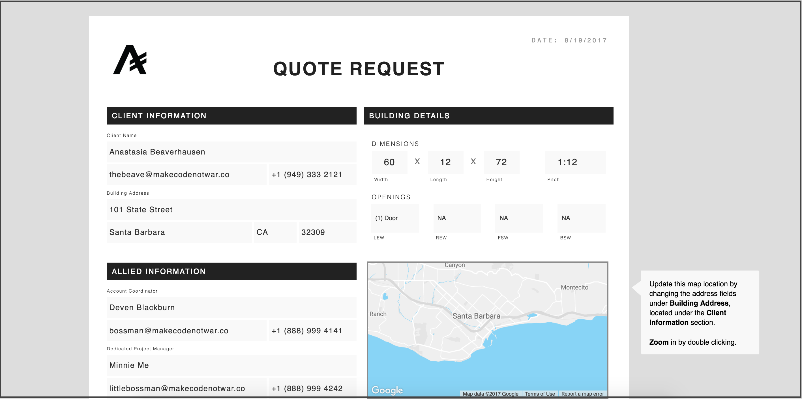
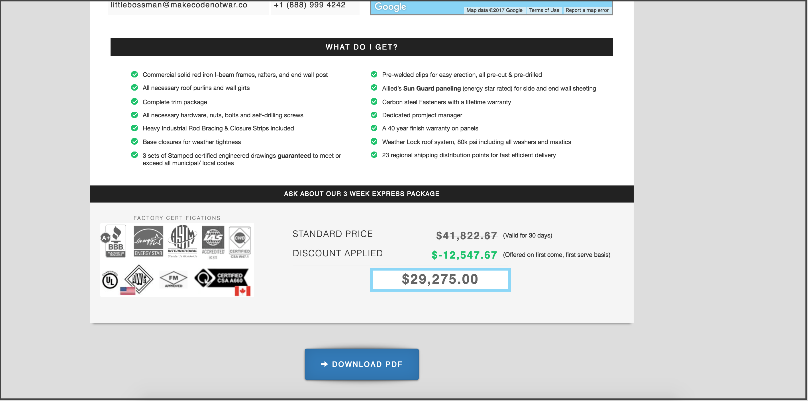
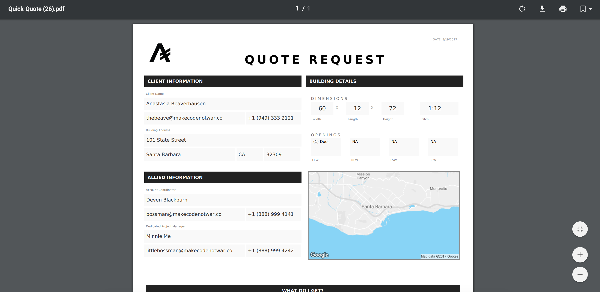

# Serverless-Web-Form-to-PDF

Clean, easy, professional webpage converts online form to PDF file using Google Apps Script, PDF Layer API, Zoho CRM API, Axios, Google Maps API, Google Static Maps API, and Google Geocoding API. :octocat:    

<br>


--------------------------

### DOCUMENTATION
--------------------------
Reference documentation resource links below for more details.  

<br>

| Technologies Used :zap: | Links |
|:-------|:------:|
| **[Google Apps Script][1]** <br/> Platform on which this serverless web app is built. | [Documentation][1] |
| **[PDF Layer][2]**  -  High quality and highly customizable HTML to PDF conversion API.  It can be quite cumbersome to style PDF. <br> *TIP*:  Incline-css works best for styling final PDF document. Thank me later. | [Documentation][2] |
| **[Zoho CRM API][3]** <br/> [Zoho][8] is an online customer relationship manager platform.  If Salesforce and Google had a baby, it's prodigy would be [Zoho][8].  The webpage in this web app is pre-populated with data from our [Zoho][8] CRM via it's RESTful API. | [Documentation][3] |
| **[Axios][4]** <br/> A promise-based HTTP client that works both in the browser and in a node.js environment. It basically provides a single API for dealing with ```XMLHttpRequests``` and node’s ```http``` interface. Besides that, it wraps the requests using a polyfill for ES6 new’s promise syntax. | [How-to Article][4] |
| **[Google Maps API][5]** <br/> Straight-forward Javascript API for map generation. | [Documentation][5] |
| **[Google Static Maps API][6]** <br/> Implement maps as images in your apps and sites.  When using PDF Layer and other HTML to PDF converters, you must provide an image-based map.  The conversion API doesn't recognize maps generated using the standard Google Maps API.  In this web app we initiated this Static API call when the user clicks to convert the webform to a PDF.  The returned object is injected with raw HTML to the page and thereby printed to the final PDF. | [Documentation][6] |
| **[Google Geocoding API][7]** <br/> Convert street addresses into geographic coordinates (like latitude and longitude) which are required for Google Map generation. In our example web app, we use data from the address, city, state, and zipcode form fields to generate our map.  Necessary since we record only street address and not exact geographic coordinates in our CRM. | [Documentation][7] |    

<br>

 ### Screenshots of web app and convert PDF:    
 --------------------------


[][9]


[][9]    

<br>

[][9]    

<br>

----------------------
:octocat:  We love open source software  |  Hire us for your next project  |  [makecodenotwar.co][9]

[1]: http://codeheaven.io/how-to-use-axios-as-your-http-client/
[2]: https://pdflayer.com/
[3]: https://www.zoho.com/developer/rest-api.html
[4]: http://codeheaven.io/how-to-use-axios-as-your-http-client/
[5]: https://developers.google.com/maps/documentation/javascript/
[6]: https://developers.google.com/maps/documentation/static-maps/
[7]: https://developers.google.com/maps/documentation/geocoding/intro
[8]: https://www.zoho.com/
[9]: http://www.makecodenotwar.co/
